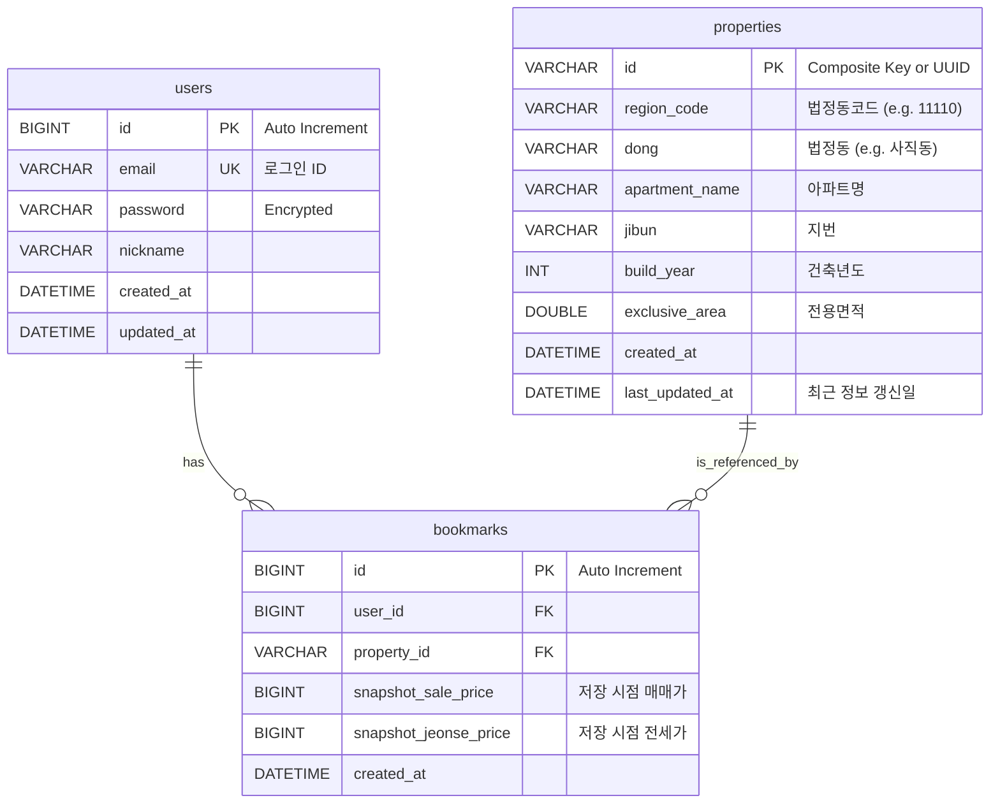

# Database Schema Design & Data Strategy

## 1. 개요 (Overview)
본 문서는 '북마크(관심 매물)' 기능을 구현하기 위한 **데이터베이스 스키마(Schema)**와 외부 API 데이터의 **동기화 전략(Data Strategy)**을 정의합니다.

## 2. 데이터 전략: Hybrid (On-Demand Cache)
외부 API(국토부)의 데이터를 효율적으로 관리하기 위해 **스냅샷(Snapshot)**과 **온디맨드 캐싱(On-Demand Cache)**을 결합한 하이브리드 방식을 채택합니다.

### 2.1 작동 방식
1.  **조회 시**: 국토부 API를 통해 실시간 데이터를 가져옵니다. (DB 저장 안 함)
2.  **북마크 클릭 시**:
    -   해당 매물이 우리 DB(`properties` 테이블)에 있는지 확인합니다.
    -   **없으면(Miss)**: `Property` 정보를 DB에 생성합니다. (기본 메타데이터 저장)
    -   **있으면(Hit)**: 기존 `Property`를 참조합니다.
3.  **저장(Save)**: `bookmarks` 테이블에 `User ID` + `Property ID`를 저장하고, 아울러 **현재 시점의 가격(Snapshot Price)**을 함께 저장합니다.

## 3. ERD (Entity Relationship Diagram)

## 4. 상세 스키마 정의 (Table DDL Definition)

### 4.1 Users (사용자)
가장 기본적인 인증 정보를 담습니다.
- **Constraints**: `email`은 유니크해야 합니다.

### 4.2 Properties (매물 캐시)
북마크된 매물들의 **'공통 기준 정보'**입니다. 한 번이라도 북마크된 적이 있는 아파트는 이곳에 정보가 남습니다.
- **ID 전략**: 외부 API에는 고유 ID가 없으므로, 비즈니스 키를 조합하여 ID를 생성하거나 UUID를 사용해야 합니다.
    - *제안 ID*: `RegionCode` + `Dong` + `Jibun` + `AptName` + `ExclusiveArea` (해싱하여 고유 키 생성)
    - 이렇게 하면 동일 아파트/동일 평형을 하나의 `Property`로 관리할 수 있습니다.

### 4.3 Bookmarks (관심 매물)
사용자와 매물 간의 매핑 테이블입니다.
- **Snapshot Price**: 갭 투자에서는 '내가 보았을 때의 가격'과 '현재 가격'의 차이가 중요하므로, **저장 시점의 가격**을 레코드에 박제(Snapshot)합니다.

## 5. 향후 확장 고려 (Scalability)
- **가격 변동 트래킹**: 추후 `property_price_history` 테이블을 두어, `properties`에 저장된 매물들에 한해 주기적(Batch)으로 최신 실거래가를 쿼리하여 시세를 업데이트할 수 있습니다.
- **알림 서비스**: 배치 작업으로 현재가와 `bookmarks.snapshot_price`를 비교하여 유의미한 변동(예: 갭 10% 감소) 발생 시 알림을 보낼 수 있습니다.
