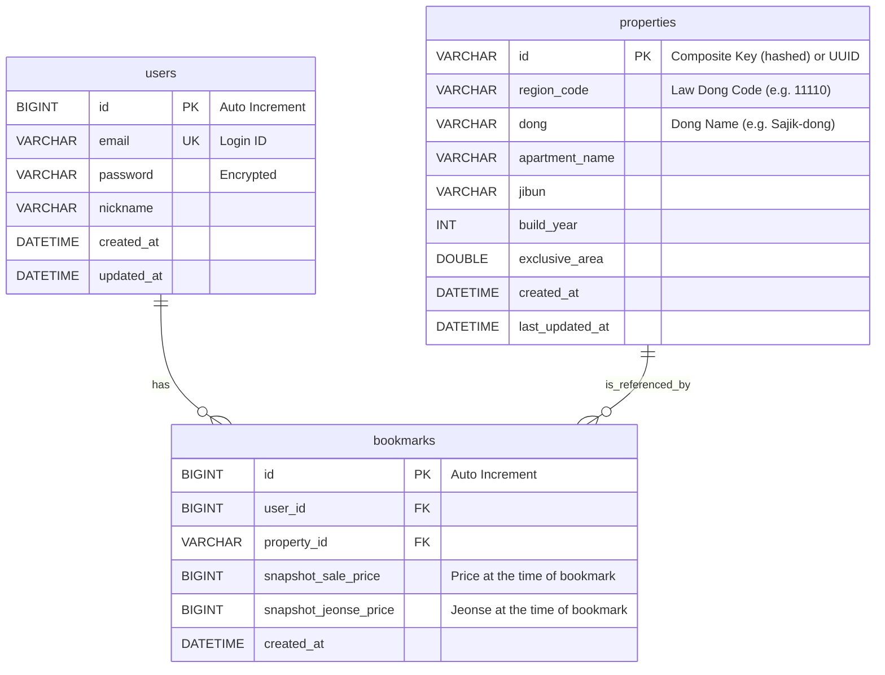

# Technical Specification

## 1. Introduction
This document outlines the technical implementation details for the **Gap Investor** application, based on the requirements defined in `PRD.md`. It serves as the primary reference for developers regarding system architecture, data models, and API design.

## 2. System Architecture
The system follows a Hexagonal Architecture (Ports and Adapters) to ensure separation of concerns and maintainability.

- **Domain Layer**: Core business logic (e.g., `Property`, `Gap` calculation). Independent of frameworks.
- **Application Layer**: Use Cases and Services orchestrating the domain logic.
- **Adapter Layer**: data access (`Persistence`) and web interfaces (`Presentation`).

For a high-level view, refer to `ARCHITECTURE.md`.

## 3. Technology Stack
Refer to `TECH_STACK.md` for the detailed list of libraries and frameworks.
- **Core**: Java 17, Spring Boot 3.2.x
- **DB**: MySQL (Prod), H2 (Local)
- **Auth**: Spring Security + JWT

## 4. Database Schema Design
We adopt a **Hybrid (On-Demand Cache)** strategy to manage property data efficiently while leveraging external API (MOLIT) data.

### 4.1 Data Strategy
1.  **Search**: Real-time fetch from MOLIT API (No DB persistence).
2.  **Bookmark (Interest)**:
    -   When a user bookmarks a property, check if it exists in the local `properties` table.
    -   **Miss**: Create a new `Property` record (metadata).
    -   **Hit**: Reuse existing record.
    -   **Save**: Insert into `bookmarks` with `User ID`, `Property ID`, and **Snapshot Prices**.

### 4.2 ER Diagram (Mermaid)

### 4.3 Table Definitions

#### Users
- Stores authentication credentials.
- `email`: Unique constraint.

#### Properties (Cache)
- Stores metadata for properties that have been bookmarked at least once.
- **ID Generation**: Since external APIs may not provide a persistent unique ID, we generate a hash key based on: `RegionCode` + `Dong` + `Jibun` + `AptName` + `ExclusiveArea`.

#### Bookmarks
- Mapping between `User` and `Property`.
- **Snapshotting**: Stores `snapshot_sale_price` and `snapshot_jeonse_price` to track the gap at the moment of interest, facilitating future comparisons with current market prices.

## 5. API Design (REST)

### 5.1 Auth API (`/api/auth`)
- `POST /signup`: Register new user.
- `POST /login`: Authenticate and receive JWT.

### 5.2 Property API (`/api/properties`)
- `GET /search`: Search properties with filters (Region, Gap, Price).
    - Params: `regionCode`, `minGap`, `maxGap`, `sort` (GAP_ASC, RATIO_DESC).
- `GET /{id}`: Get detailed property info.

### 5.3 Bookmark API (`/api/bookmarks`)
- `POST /`: Toggle bookmark (Add/Remove).
- `GET /`: List user's bookmarked properties.

## 6. Key Algorithms & Logic

### 6.1 Gap Calculation
- `Gap = SalePrice - JeonsePrice`
- `JeonseRate = (JeonsePrice / SalePrice) * 100`

### 6.2 Sorting & Filtering
Sorting is performed in memory or via stream processing when fetching from external APIs if the API does not support complex sorting.
- **Priorities**: Gap (Ascending), JeonseRate (Descending).

## 7. Security
- **JWT**: Stateless authentication.
- **Password**: BCrypt hashing.
- **CORS**: Configured for frontend access.
